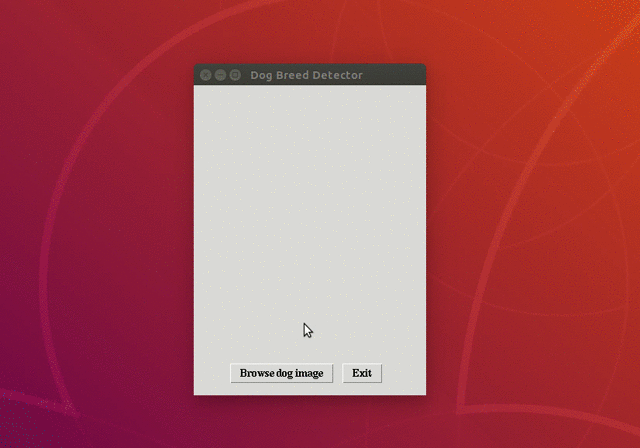

# Tkinter Dog breed detector

Python dog breed detector program built with Tkinter and TensorFlow

## Demo



## Usage
<br>

1 - Run this program :

```
pip install -r requirements.txt

python dog_breed_detector.py

```

2 - (Optional) In order to distribute this program, compile it with **pyinstaller** following these instructions :

```
python -m venv environment

source environment/bin/activate

pip install -r requirements.txt

pyinstaller -p $PWD/dog_breed_detector_package dog_breed_detector.py \
            --add-data 'data_files/*.*:data_files' \
            --additional-hooks-dir ./hooks/ \
            --onefile \
            --hidden-import='PIL._tkinter_finder'
```
