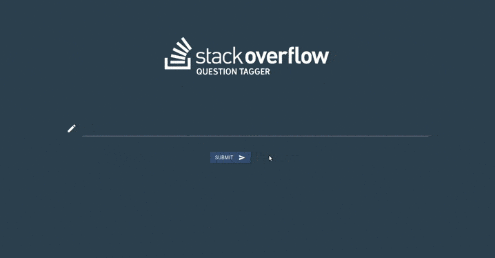

# OpenClassrooms Machine Learning Engineer Path

## Project 5: Automatically categorize questions

### I - Project description :

This project is an API built with a recurrent neural network (GRU) which tag questions from Stack Overflow website.

**Problematic :**

_Lover of Stack Overflow, which has often saved you the day, you decide to help the community in return._

_To do this, you develop a tag suggestion system for the site. This will take the form of a machine learning algorithm that automatically assigns several relevant tags to a question._


**Methodology :**

Three learning methodologies were compared in order to pursue this project :
- **unsupervised learning** : using **TF-IDF** text vectorizer and topic modeling with **LDA** algorithm
- **supervised learning** : using again **TF-IDF** as text vectorizer and **SVM** multi-class with One-vs.-rest strategy as text classifier
- **semi-supervised learning** : using **Word2Vec** as features extractor and **GRU** as text classifier

Hyperparameters optimization methods used were **grid search** and **bayesian
 optimization** made easy with [optuna](https://optuna.org/)

**Evaluation results :**

|  Metric\Model   | LDA | SVM |  GRU  |
| --------------  | --- | ----- | ----- |
|    Accuracy     | N\A |  30.1 |  **51.9** |
|    F1-score     | N\A |  61.2 |  **71.4** |


**Main data :**

Datasets were extracted from [Stack Exchange Data Explorer](https://data.stackexchange.com/stackoverflow/query/new) by querying in Microsoft SQL Server.

- Extraction method :
    - sample data by month
    - filter by question score and answer count

- Query type :
    ```sql
    SELECT -- Question part
           q.Id,
           q.Score,
           q.AnswerCount,
           q.CreationDate,
           q.Title,
           q.Body,
           q.Tags,
           -- Accepted answer part
           a.Id AS AnswerId,
           a.Score AS AnswerScore,
           a.CreationDate AS AnswerCreationDate,
           a.Body AS Answer
    FROM posts q
    INNER JOIN posts a ON q.AcceptedAnswerId = a.Id
    WHERE YEAR(q.CreationDate) = 2019
      AND MONTH(q.CreationDate) = 01 -- Repeat query for each month
      AND q.DeletionDate IS NULL     -- Valid Question (not deleted)
      AND q.Score > 0                -- Question with more upvotes than downvotes  
      AND q.AnswerCount > 0          -- Question with at least one answer
    ORDER BY q.Id DESC
    ```

**Project architecture :**

- **_config_** folder which contains main configuration variables related to the notebooks and API of this project.
- **_deployed_api_** folder which contains the deployed API code.
- **_notebooks_html_** folder which contains jupyter notebooks in HTML format.
- **_notebooks_ipynb_** folder which contains jupyter notebooks in .ipynb format.
- **_src_** folder which contains several personal packages and modules coded in python.
- **_static_** folder which contains the frontend code of the API.
- **_templates_** folder which contains the main API Flask template (HTML view).
- **_utils_** folder which contains helpers related to the notebooks and API of this project.

**Description of notebooks :**

- **[P5_01_notebook_exploratory_data_analysis](https://github.com/4D1L-PY/Portfolio/blob/main/OC-MLE/StackOverflow-Question-Tagger/notebooks_ipynb/P5_01_notebook_exploratory_data_analysis.ipynb)** which covers the data cleaning & text preprocessing steps
- **[P5_02_notebook_modelization.ipynb](https://github.com/4D1L-PY/Portfolio/blob/main/OC-MLE/StackOverflow-Question-Tagger/notebooks_ipynb/P5_02_modelization.ipynb)** which corresponds to the main modeling work.

### II - API :

The project API (named _Stack Overflow Question Tagger_) is a single-page application built in python with [Flask](https://flask.palletsprojects.com/en/1.1.x/).

The final API code was deployed and hosted on an [Amazon EC2](https://aws.amazon.com/ec2/?nc1=h_ls&ec2-whats-new.sort-by=item.additionalFields.postDateTime&ec2-whats-new.sort-order=desc) t2.micro instance.


**Example** :



**N.B :**

This API is no longer available.

<!-- **Try it :**

Click on the following link to try this API :
[Stack Overflow Question Tagger](http://15.237.104.16:8080/) -->
