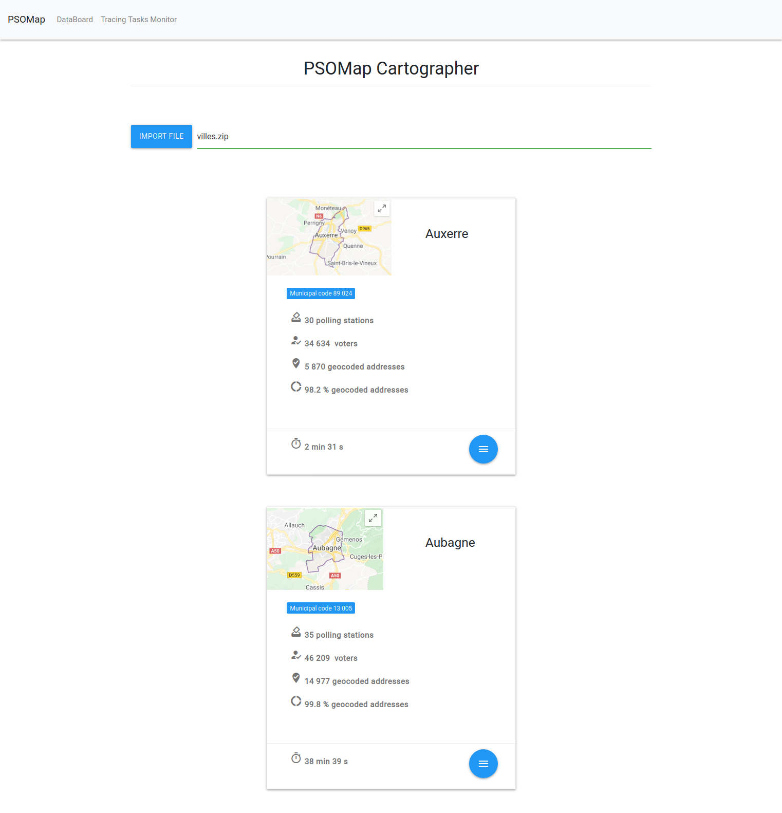

PSOMap Cartographer
=======================

Description
-----------

PSOMap Cartographer is a flask app which build french polling stations outlines from one or many addresses list files referred to a specific location.

It uses celery & redis in order to run multiples tracing tasks from different files.

Addresses list files extensions supported are :
- csv
- xls/xlsx
- txt
- zip

NB :

A clustering algorithm (HDBSCAN) is used in order to filter outliers. Despite the fact that we don't use our labelled data (polling stations id),
this method didn't affect our working dataframe because it only filters data which we want to consider as outliers based on specific quantile
(so it doesn't matter if data is misclassified).

Overview
-----------

To do list
-----------

- Improve UI design (background, UX & UI conception ...)
- Build unique charts view (ungeocoded addresses donut chart + histogram)
- Update map view (https://www.jawg.io/fr/pricing , https://python-visualization.github.io/folium/)
- Use Kepler.gl to show electoral data (refactor cleaning script & create postgres electoral db & make a test)
- Clean & document JS code
- Clean & document Python code (update geomodules Readme.md)
- Add ways count (card's left-side)

Quick Setup
-----------

1. Clone this repository.
2. Create a virtualenv and install the requirements.
3. Open a second terminal window and start a local Redis server `python utils/run_redis_server.py`
4. Open a third terminal window and start a Celery worker: `python utils/run_celery_worker.py`.
5. Optional : open a fourth terminal window and start Flower tasks monitoring: `python utils/run_tasks_monitor.py`
6. Start the Flask application on your original terminal window: `python views.py` & open `http://localhost:5000/` link.
